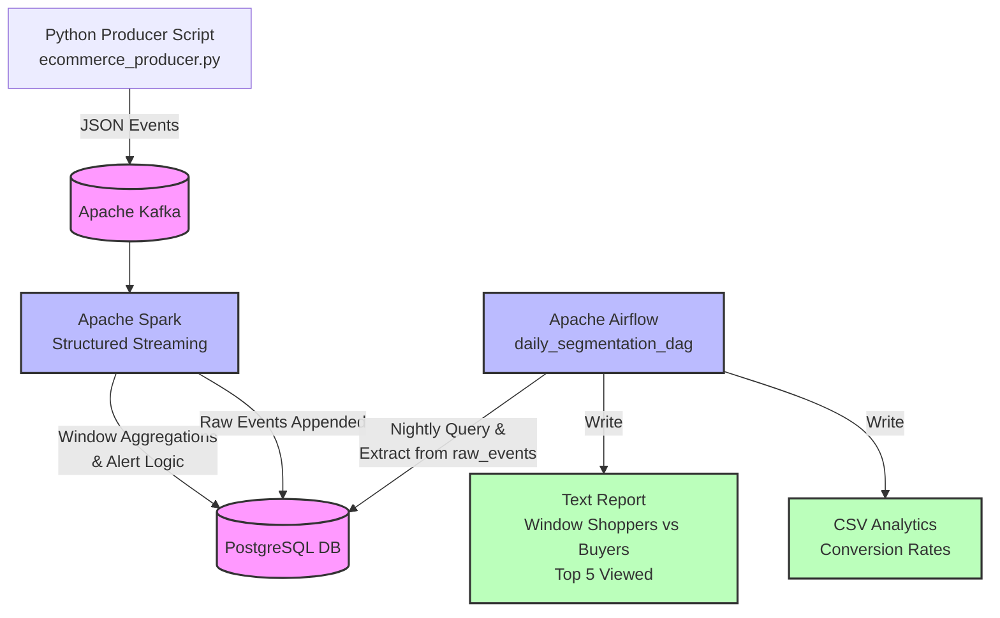

# E-Commerce Clickstream Big Data Pipeline Architecture

Follow this Flow Architecture for the E-Commerce Clickstream Mini-Project.

### Components Summary:
1. **Producer**: Python simulating IoT/Clickstream scaling.
2. **Kafka**: Ingests JSON payloads into `ecommerce-events` topic.
3. **Spark**: Filters, applies 10-minute sliding window, outputs metrics & alerts.
4. **PostgreSQL**: Serves as persistent sink (data warehouse format) for `raw_events` and `alerts`.
5. **Airflow**: Nightly DAG querying PostgreSQL to calculate user segmentations and report outputs.
